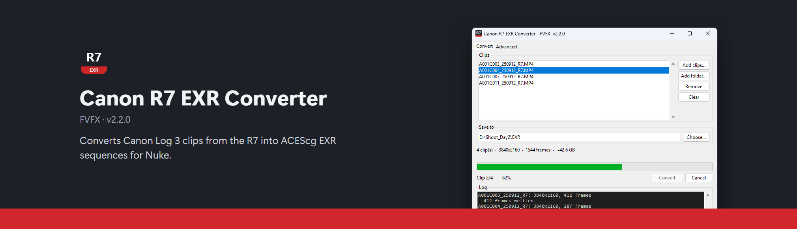

# Canon R7 EXR Converter - FVFX

Turns Canon EOS R7 Canon Log 3 clips into **scene-linear EXR sequences** (and
optionally ProRes) that drop straight into Nuke.

**[Download the latest version](https://github.com/VMarci2/r7convert/releases/latest)**
(the `Setup.exe` is recommended: it updates itself) ·
**[Documentation](https://vmarci2.github.io/r7convert/)**

The zip contains the exe, bundled ffmpeg and exiftool, and `Manual.pdf`; nothing
needs installing. Both builds check for updates when they start.

**To develop it:**

```
setup.bat     once, builds .venv and installs numpy + OpenImageIO
run.bat       launches the app from source
```

From source it needs Python 3.10+ and ffmpeg on PATH; exiftool is optional.

## Building the release

```
python packaging/build_release.py --ffmpeg-bin <dir> --exiftool-dir <dir>
```

Writes `dist/Canon R7 EXR Converter vX.Y.Z/`,
`release/Canon R7 EXR Converter vX.Y.Z.zip` and, if Inno Setup 6 is installed
(`winget install JRSoftware.InnoSetup`), the single-file installer
`release/Canon R7 EXR Converter vX.Y.Z Setup.exe` from `packaging/installer.iss`.
It installs per user into `%LOCALAPPDATA%\Programs` (no admin rights), wrapping
the same folder build, so nothing unpacks to a temp folder at launch.
`--installer-only` rebuilds just the installer from an existing `dist` folder.

**Versioning.** The one version number lives in `r7convert/__init__.py`
(`__version__`). The build stamps it into the folder and zip names, the exe name
(`Canon R7 EXR Converter vX.Y.Z.exe`), the exe's file properties (File/Product
version), the window title, the manual and a `VERSION.txt` in the app folder
(which also carries `CHANGELOG.md`). To release: bump `__version__`, add a
`CHANGELOG.md` entry, rebuild the manual, run the build. The build refuses to
overwrite an existing release of the same version unless given `--force`.
Run it from an environment with `requirements.txt` plus PyInstaller **installed
from source** so the bootloader is compiled locally:

```
set PYINSTALLER_COMPILE_BOOTLOADER=1
set PYINSTALLER_BOOTLOADER_WAF_ARGS=--gcc
pip install --no-binary pyinstaller pyinstaller      (with MinGW gcc on PATH)
```

Choices made to keep antivirus and SmartScreen quiet without code signing:

- **Folder build, not one-file.** One-file exes unpack to a temp folder on every
  launch, the behaviour AV heuristics flag most.
- **Locally compiled bootloader.** The stock PyInstaller bootloader is shared
  with malware and carries its signatures.
- **No UPX**, plus a version resource and icon on the exe.
- SmartScreen still shows "Windows protected your PC" once for a downloaded zip
  (More info → Run anyway); only code signing removes that.

ffmpeg is the BtbN **LGPL shared** 8.1 build (160 MB for ffmpeg + ffprobe,
against 420 MB for the static full build); its decode output is bit-identical to
the 8.0.1 full build for this footage. The build copies its licence alongside it.
The release zip and folder scan clean with Windows Defender.

## Publishing an update

Releases live on GitHub at
[VMarci2/r7convert](https://github.com/VMarci2/r7convert/releases), and the app
checks there for updates. To ship a new version:

```
1. bump __version__ in r7convert/__init__.py, add a CHANGELOG.md section for it
2. python packaging/build_release.py --ffmpeg-bin <dir> --exiftool-dir <dir>
3. git commit -am "Release vX.Y.Z"
4. python packaging/publish_release.py            (--draft to check it first)
```

`publish_release.py` pushes the commit, tags `vX.Y.Z`, and creates the GitHub
release with the Setup.exe, the zip and a `latest.json` manifest (version,
installer URL, SHA-256, and the CHANGELOG section as notes). It needs the `gh`
CLI logged in (`gh auth login`) and refuses to run with uncommitted changes or
for a version that already has a tag.

**How the app updates.** When it starts (exe builds only), and from Advanced →
*Check for updates*, the app fetches
`https://github.com/VMarci2/r7convert/releases/latest/download/latest.json`.
That URL is served by GitHub's download CDN, not the REST API, so a lab full of
students on one campus IP doesn't hit the API's 60-requests/hour limit. If the
version is newer:

- **Installed** (an `unins*.exe` next to the exe): it downloads the Setup.exe,
  checks its SHA-256 against the manifest, runs it with `/SILENT /UPDATE=1` and
  closes. `installer.iss` reopens the app afterwards when `/UPDATE=1` is passed.
  The downloaded installer goes in `%TEMP%\r7convert-update` and is deleted on
  the next launch.
- **Zip** copies can't replace their own folder, so they open the release page.

No prompt appears while a conversion is running. A draft release is invisible
to the app until you publish it on GitHub. To test against another manifest,
set `R7_UPDATE_URL` before launching.

## Using it

1. **Add clips** (files, or a whole card folder).
2. **Choose where to save.**
3. **Convert.**

That is the whole workflow. Everything else has a default that is correct for an
R7 shooting Canon Log 3, and the camera colour space is read from the clip's own
Canon metadata. The Convert tab shows a size estimate once clips are loaded,
because a 5-second 4K clip becomes about 3.7 GB.

**Default output: ACEScg.** The Canon Log 3 curve is removed and the values are
converted from the camera's colour space (Cinema Gamut for R7 footage) to ACEScg
(AP1), and the EXR carries those chromaticities. This is the recommended
workflow: keep the default and set Nuke up for ACES.

**Setting up Nuke.** In **Edit → Project Settings → Color** (or press S in the
Node Graph), set **color management** to **OCIO** and pick an ACES 1.3 config in
**OCIO config** (the studio config also has the Canon camera colourspaces). The
working space then becomes `scene_linear` (ACEScg). Set the Read node's
colourspace to `ACEScg`. See Foundry's [OCIO Color Management](https://learn.foundry.com/nuke/content/comp_environment/configuring_nuke/using_ocio_config_files.html)
page for details.

> Don't use Nuke's legacy colour management (nuke-default) with this footage.
> **Linear, camera primaries** is there for pipelines that want Cinema Gamut
> untouched (read as `Linear CinemaGamut D55`); **Linear Rec.709** is not recommended:
> much of the camera's wide gamut falls outside it and turns into negative values.

All three outputs were checked against the `CanonLog3 CinemaGamut D55` transform
in Nuke 16's own studio OCIO config: median difference 0.017% to `Linear
CinemaGamut D55`, 0.09% to `Linear Rec.709 (sRGB)` and 0.08% to `ACEScg`. The
same test puts a full-range decode 13.6% off, which independently confirms the
legal-range reading below.

The Advanced tab has two groups. **Colour** holds the manual camera-gamut override
and the output colour space. **Format** holds output size and the formats: EXR
sequence (bit depth, compression, frame numbering) and/or ProRes .mov (quality).
Each format's settings only show while it is ticked. Reset to defaults puts
back EXR only.

---

## What the footage actually is

An R7 Canon Log 3 clip is HEVC (Rext profile) `yuv422p10le`, and the container
tells you almost nothing useful:

```
color_space     = bt709          <- the YCbCr matrix, not the gamut
color_range     = pc  (full)     <- see below, this is a trap
color_transfer  = unknown
color_primaries = unknown
```

The part that matters is only in the Canon maker notes, which is why exiftool is
worth having:

```
CanonLogVersion : CLogV3
ColorSpace2     : CinemaGamut
```

## Two things that quietly break naive conversions

**1. The full-range flag lies.** The stream is flagged `pc` (full range), but
Canon Log 3 is anchored on the *legal* range code mapping — black is 10-bit code
**128**, nominal white is code **940**. A histogram of R7 shadows puts the noise
floor right on 128, and Canon's own published figures only line up on that
scale:

| | this implementation | Canon spec |
|---|---|---|
| black, x=0.0 | 7.3059 IRE → code 128.0 | 7.3 IRE, code 128 |
| 18% grey, x=0.2 | 32.7954 IRE | 32.8 IRE |
| 90% white, x=1.0 | 58.6138 IRE | 58.6 IRE |

So the decode is `ire = (code - 64) / 876`, **not** `code / 1023`. Getting this
wrong lifts the blacks and compresses the whole curve.

The YCbCr → R'G'B' step runs with `in_range=full:out_range=full`, which tells
swscale *not to remap levels at all* — the code values arrive intact and the
legal-range anchoring is applied afterwards, in the tone curve.

**2. ffmpeg cannot write half-float EXR.** Its encoder clamps to `[0,1]` in the
half path, so a linear value of 1.114 comes back as 0.99991 and every highlight
above ~2.5 stops over grey is destroyed silently. This is why EXR output goes
through OpenImageIO. If you ever hand-roll an ffmpeg EXR command, `-format
float` is mandatory.

A third, smaller trap: several widely copied versions of the Canon Log 3
constants use segment thresholds of `0.097465473` / `0.15277891`. Those belong
to a different Canon Log variant and leave discontinuities of up to 8% in the
shadows. The thresholds here (`0.04076162` / `0.105357102`) join exactly at
x = ±0.014.

## Output

`<output>/<clipname>/<clipname>.0001.exr` …

Each frame carries `chromaticities`, `framesPerSecond`, SMPTE `timecode`
(advanced per frame from the clip's start TC), camera and lens, and a `comment`
recording the transform.

Downscales are Lanczos and happen **in scene linear**, so highlight energy is
preserved rather than averaged inside a log curve.

### ProRes

`<output>/<clipname>.mov`, written next to the EXR folder when both are ticked.
It follows the Output colour space, so it is the **same scene-linear image**
as the EXRs, not a display-referred Rec.709 grade. That avoids the old
double-tone-mapping problem under an ACES viewer, but ProRes is integer: the
linear values are clipped to [0, 1] and quantised before encoding, so anything
brighter than 1.0 (about 2.5 stops over grey) is lost. On the R7 test clip
that was 16% of all pixel values. It is a review/editorial file; composite from
the EXRs.

Encoding is `prores_ks` (default 422 HQ 10-bit), with the clip's timecode and
original audio. Frames go to a second ffmpeg process in order through a small
reorder window, so worker count does not change the result (verified
bit-identical across 1, 2 and 4 workers). Rec.709 and BT.2020 outputs are
tagged with their primaries and a linear transfer; ACEScg and Cinema Gamut have
no ffmpeg tag, so set the Read colour space in Nuke by hand.

### Compression

Measured on one real 4K frame of this footage, 16-bit half, RGB:

| scheme | size | ratio | write | read | lossless | what it is |
|---|---|---|---|---|---|---|
| none | 49.8 MB | 1.00× | 0.149 s | 0.161 s | yes | raw half floats |
| RLE | 41.8 MB | 1.19× | 0.116 s | 0.176 s | yes | run-length; needs flat areas, useless on grain |
| **ZIP** | 29.6 MB | 1.68× | 0.138 s | **0.046 s** | yes | deflate over 16-scanline blocks — the default |
| ZIPS | 30.4 MB | 1.64× | 0.131 s | 0.163 s | yes | deflate per single scanline; random row access |
| **PIZ** | **27.4 MB** | **1.82×** | **0.091 s** | 0.051 s | yes | wavelet + Huffman, built for grain — best here |
| PXR24 | 31.1 MB | 1.60× | 0.123 s | 0.050 s | yes¹ | truncates float32 to 24-bit |
| B44 | 21.8 MB | 2.29× | 0.061 s | 0.036 s | no | fixed-rate, constant size, for realtime playback |
| DWAA | 7.7 MB | 6.46× | 0.218 s | 0.061 s | no | DCT, like JPEG; 32-scanline blocks |
| DWAB | 7.5 MB | 6.63× | 0.467 s | 0.087 s | no | same, 256-scanline blocks |

¹ lossless *for half input* — PXR24 only discards precision from float32.

**PIZ is the technical best for these plates**: smallest lossless result *and*
the fastest to write, because its wavelet+Huffman stage was designed for grainy
live action and 10-bit camera noise is exactly that. ZIP stays the default
because it is what most pipelines expect and it reads fastest.

RLE is pointless on camera footage — noise has no runs to collapse. DWAA is for
when storage dominates, but it is DCT-lossy, so avoid it on anything destined
for a key or a heavy push.

For this 5.4 s / 135-frame clip: half+PIZ 3.4 GB, half+ZIP 3.7 GB,
half+DWAA 1.0 GB, 32-bit+ZIP 11 GB.

## Performance

~0.31 s per 4K frame, about 3.1× faster than the first working version.

The bottleneck is not what you would guess. ffmpeg decodes a 4K frame in
**0.044 s**, but moving that 49.8 MB frame through a Windows pipe takes
**~0.30 s** — the pipe tops out around 168 MB/s and buffer size makes no
difference (measured from 8 KB to 16 MB). Everything else had to be hidden
behind that transfer:

| | s/frame |
|---|---|
| original, fully serial | 0.955 |
| reader thread + 1 worker | 0.408 |
| **reader thread + 2 workers** | **0.309** |
| 4 workers | 0.321 |
| 6 workers | 0.347 |

Two workers is optimum; past that the pipe is the wall and extra threads only
add contention. Within a frame, `np.dot(..., out=preallocated)` is ~4× faster
than `linear @ matrix.T` and `np.copyto` beats `.astype(np.float16)`, both
because first-touching 50–100 MB of fresh pages costs more than the arithmetic.
Fancy indexing (`lut[codes]`) measured faster than `np.take`.

All of it is verified bit-identical: 1 worker and 4 workers produce byte-for-byte
equal EXRs and timecodes, and each optimisation was compared against the naive
expression with `np.array_equal`, not a tolerance.

## Layout

```
r7convert/
  colour.py    Canon Log 3 transfer function, gamut matrices, gamut detection
  media.py     ffmpeg/exiftool discovery, clip probing, SMPTE timecode packing
  convert.py   the pipeline, the option tables and the size estimate
  ui.py        tkinter front end (Convert tab + Advanced tab)
  update.py    update check and self-install from GitHub releases
```

Gamut matrices are derived at runtime from primaries and white points
(normalised primary matrix + Bradford adaptation) rather than hardcoded, so
adding a gamut means adding four chromaticity pairs to `colour.GAMUTS`.

## How this was checked

- The tone curve reproduces all three of Canon's published anchors and is
  continuous at both segment joins.
- The ffmpeg/`geq` implementation and the numpy/OpenImageIO one were written
  independently and agree to within half-float quantisation (99.9th percentile
  relative difference 0.047%).
- Pixel values match an analytic prediction from the source code values to
  0.00002% in 32-bit, 0.017% median in 16-bit half.
- Gamut matrices preserve neutrals exactly (rows sum to 1.0) and give the
  identity for a gamut to itself.
