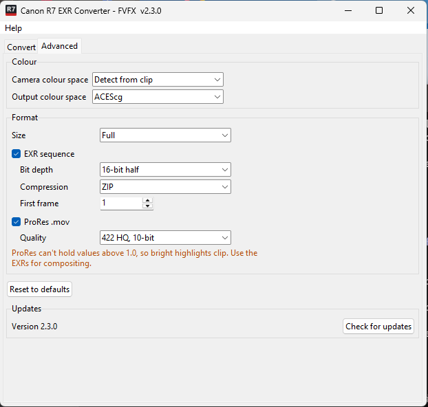

# Advanced settings

The **Advanced** tab holds settings that normally don't need changing.
**Reset to defaults** puts all of them back.

## Colour

These apply to every format.

| Setting | Default | Options |
|---|---|---|
| Camera colour space | Detect from clip | Detect from clip, Canon Cinema Gamut, BT.709 / sRGB, BT.2020 |
| Output colour space | ACEScg | ACEScg; Linear, camera primaries; Linear Rec.709 |

**Camera colour space** is normally read from the clip's Canon metadata. Only
set it by hand if the log says *Colour space not found in clip* and you know the
camera was set to something other than Cinema Gamut.

**Output colour space** decides what the files contain. Keep **ACEScg** unless
your pipeline asks for something else, and read the files in Nuke to match
(see [Opening in Nuke](nuke.md)).

## Format

**Size** applies to every format: Full, 1920 wide or 1280 wide. The aspect
ratio is kept, and downscaling happens in linear light so highlights keep their
energy.

Tick one or both formats. Each format's own settings only appear while it is
ticked.

### EXR sequence

On by default.

| Setting | Default | Options |
|---|---|---|
| Bit depth | 16-bit half | 16-bit half, 32-bit float |
| Compression | ZIP | ZIP, PIZ, ZIPS, DWAA (lossy), None |
| First frame | 1 | Any whole number |

16-bit half holds the full range of the camera; 32-bit float almost triples
the size for no visible gain.

### ProRes

Off by default. Writes `<clip>.mov` next to the EXR folder, with the clip's
timecode and audio.

| Quality | Notes |
|---|---|
| **422 HQ, 10-bit** (default) | Good all-round review and editorial quality. |
| 422, 10-bit | Smaller, still fine for review. |
| 422 LT, 10-bit | Offline editing. |
| 422 Proxy, 10-bit | Smallest; rough cuts only. |
| 4444, 10-bit | Full-resolution colour (no chroma subsampling). |
| 4444 XQ, 10-bit | Largest. |

!!! warning "ProRes clips the highlights"
    ProRes follows the **Output colour space**, so it holds the same
    scene-linear image as the EXRs. But ProRes stores whole numbers, so
    everything brighter than **1.0** (about 2.5 stops over middle grey) is cut
    off: skies, lamps, specular highlights. On the R7 clip used for testing, that
    was 16% of all pixel values. **Use the ProRes for review and editing; composite from
    the EXRs.**

## File size

Measured on R7 4K footage, per frame and for a 5.4-second (135-frame) clip:

| Setting | Per frame | 5.4 s clip | Lossless |
|---|---|---|---|
| EXR 16-bit, ZIP (default) | 29.6 MB | 3.7 GB | Yes |
| EXR 16-bit, PIZ | 27.4 MB | 3.4 GB | Yes |
| EXR 16-bit, ZIPS | 30.4 MB | 3.8 GB | Yes |
| EXR 16-bit, DWAA | 7.7 MB | 1.0 GB | No |
| EXR 16-bit, None | 49.8 MB | 6.3 GB | Yes |
| EXR 32-bit, ZIP | 81 MB | 11 GB | Yes |
| EXR 16-bit, ZIP, 1920 wide | 7.4 MB | 0.9 GB | Yes |
| ProRes 422 HQ | 3.6 MB | 0.5 GB | No |

The Convert tab shows an estimate for your current settings before you start.
