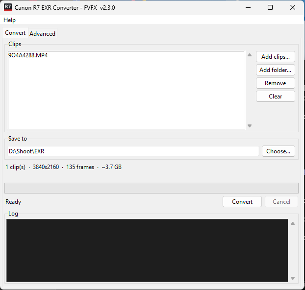

# Converting clips



1. Click **Add clips…** to pick files, or **Add folder…** to add every video in
   a folder. **Remove** and **Clear** take clips off the list.
2. Check the **Save to** folder. It defaults to an `EXR` folder next to the first
   clip; click **Choose…** to change it.
3. Click **Convert**. Progress shows in the bar and the log, and a message
   appears when all clips are done, offering to open the folder.

The line under the folder shows the number of clips, resolution, total frames
and the **estimated size on disk** before you start. 4K EXRs are large, at
about 3.7 GB for every 5 seconds of footage, so check that the drive has room.

**Cancel** stops after the frame being written. Frames already written stay on
disk.

!!! tip "Use the original camera files"
    Convert the `.MP4` files straight off the card. Clips that were trimmed or
    re-exported in another program lose the Canon metadata that tells the
    converter which colour space the camera used.

## Output

Each clip gets its own folder, named after the clip:

```text
EXR\9O4A4288\9O4A4288.0001.exr
EXR\9O4A4288\9O4A4288.0002.exr
…
```

If ProRes is switched on ([Advanced settings](advanced.md#prores)), a
`9O4A4288.mov` is written next to the folder.

Each EXR carries the clip's frame rate, SMPTE timecode (counting up from the
clip's start timecode), camera and lens model, colour space chromaticities, and
a comment recording the conversion.

!!! warning "Existing files are overwritten"
    Converting the same clip into the same folder again replaces the frames
    without asking.

Next: [open the frames in Nuke](nuke.md).
