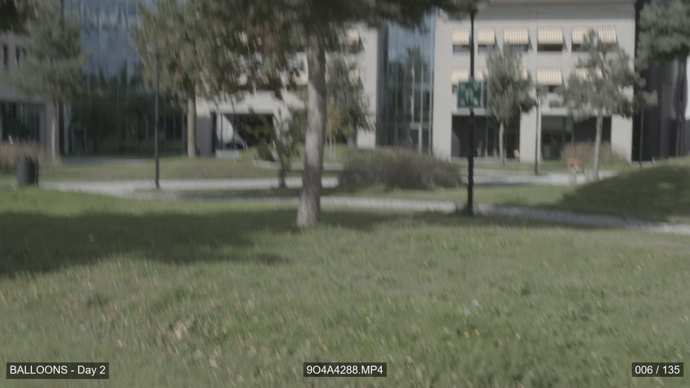
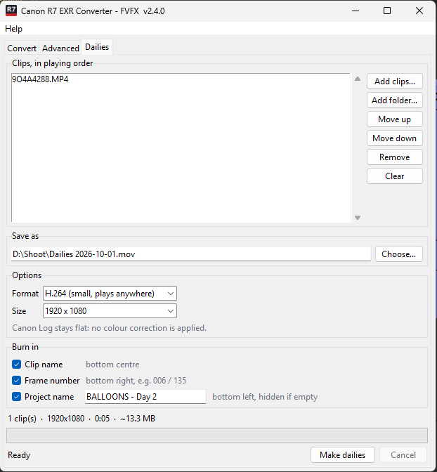

# Dailies

Dailies join clips **one after another into a single video**, with information
burnt into the picture. Use them to share a day's footage or review takes.

| Where | What |
|---|---|
| Bottom left | Your project name |
| Bottom centre | The clip's file name |
| Bottom right | Frame number and the clip's total frames, e.g. `006 / 135` |

Each one can be switched on or off. The text is Arial, on a 50% black box, and
the frame counter restarts at 1 for each clip.

## Making dailies

1. Open the **Dailies** tab.
2. Click **Add clips…** or **Add folder…**. The clips play in list order:
   select one and use **Move up** / **Move down** to change it.
3. Check **Save as**. It defaults to `Dailies <date>.mov` next to the first clip.
4. Choose the options (or leave the defaults):

    | Option | Choices |
    |---|---|
    | Format | **H.264** (default: small, plays anywhere), ProRes 422 HQ, ProRes 422, ProRes 422 LT |
    | Size | **1920 x 1080** (default), Same as first clip |

5. Under **Burn in**, tick what should appear in the picture. All three are on
   by default. Type a **Project name** to show it bottom left; if the box is
   empty, or its tick is off, nothing is shown there.
6. Click **Make dailies**. When it's done, the app offers to play the file.

The line above the progress bar shows the length and estimated file size.

!!! info "The picture looks flat and grey: that's normal"
    Dailies show the footage **exactly as the camera recorded it**. Canon Log 3
    is a log recording, so it looks low-contrast and desaturated. No colour
    correction or LUT is applied, so everyone sees the real recording.

## Good to know

- **Mixed clips are fine.** Clips of a different size are fitted inside the
  frame with black bars. Clips at a different frame rate are converted to the
  first clip's frame rate (frames are repeated or dropped), and the log says so.
- **Sound is included.** Clips without sound get silence, so the audio stays
  in sync.
- **Sizes:** H.264 at 1080p is about 2.5 MB per second of footage, and ProRes
  422 HQ about 25 MB per second.
- **H.264 vs ProRes:** pick H.264 for sharing, uploading or watching on a laptop.
  Pick ProRes if the dailies are going into an editing program.
- You can't make dailies and convert at the same time: one job runs at a time.
